# Instances and Servers:
* An instance in cloud computing is a server resource provided by third-party cloud services. 
* Cloud providers maintain hardware in their data centers and give us virtual access to compute resources in the form of an instance. 
* We can use the cloud instance for running compute-intensive workloads like containers, databases, microservices, and virtual machines.

## Step 1: Create an EC2 Instance
* There are six AWS Direct Connect locations, all of which connect to the Asia Pacific (Mumbai) Region, giving enterprises, public sector organizations, and startups,access to state-of-the-art public cloud infrastructure.
* When we view our resources, we see only the resources that are tied to the AWS Region that we have specified. This is because AWS Regions are isolated from each other, and we can’t replicate resources across AWS Regions.
* Benefits : Choosing an AWS Region with close proximity to our user base location can achieve lower network latency. 
* It can also increase communication quality, given that network packets have fewer exchange points to travel through. 
* AWS services are priced differently from one Region to another. Asia Pacific (Mumbai) Region costs at 0.579 dollars. The cheapest of all regions is the US East(Ohio) region at 0.568 dollars.

We have to select the location Asia Pacific(Mumbai) and click on the “Launch instance”. Please choose region of your interest.

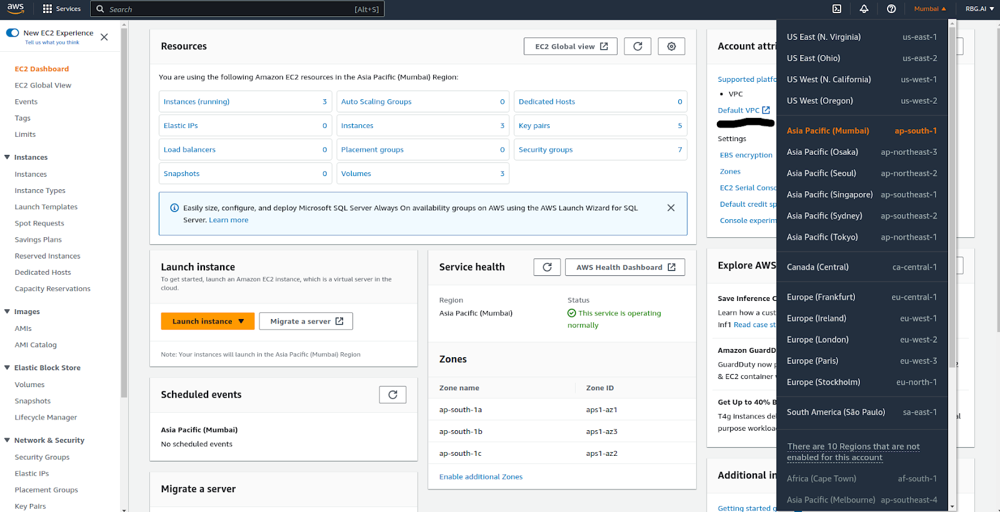

In the launch instance, we have to provide the name, set the GPU to “Amazon linux 2023 AMI”.

#### AMI(Amazon machine image)
An Amazon Machine Image (AMI) is a master image for the creation of virtual servers -- known as EC2 instances -- in the Amazon Web Services (AWS) environment. AMIs can be selected based on the following factors:
Region. Users can specify which region they want to search for an AMI among the EC2 locations around the world.
Operating system. Users can select an AMI image by specifying an operating system, such as Linux.
Architecture. The AMI architecture will either be 32-bit or 64-bit depending on the underlying operating system.
Launch permissions. An owner decides the launch permission for an AMI, which can be public, explicit or implicit.
Storage for the root device.

To create an AMI from an instance:
Right-click the instance you want to use as the basis for your AMI, and choose Create Image from the context menu.
In the Create Image dialog box, type a unique name and description, and then choose Create Image. By default, Amazon EC2 shutdown the instance, takes snapshots of any attached volumes, creates and registers the AMI, and then reboots the instance.
It may take a few minutes for the AMI to be created. After it is created, it will appear in the AMIs view in AWS Explorer.


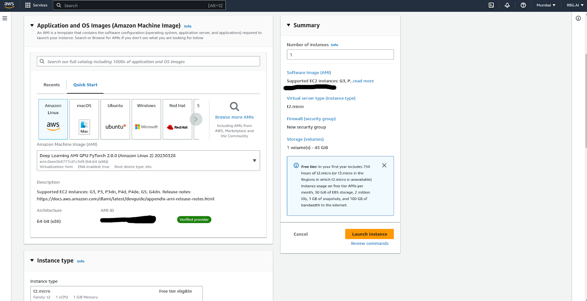

If your workload is related to AI/ML/DL search for **Deep Learning AMI GPU PyTorch 2.0.1 (Ubuntu 20.04)**  
Or **Any OS of your choice**.

-> Set the instance type to “g4dn-xlarge”. (The "g4dn-xlarge" instance type is a type of Amazon EC2 instance that is optimized for machine learning (ML) workloads and can provide high-performance computing capabilities. It is equipped with NVIDIA T4 GPUs, which can accelerate ML workloads and deliver faster training and inference times.) You may select the instance of your choice based on the workload.
-> For free tier set the instance type to "t2.micro". (This "t2.micro" instance type is designed for general purpose workloads that do not require high CPU usage.It is one of the lowest priced AWS EC2 instance option.)

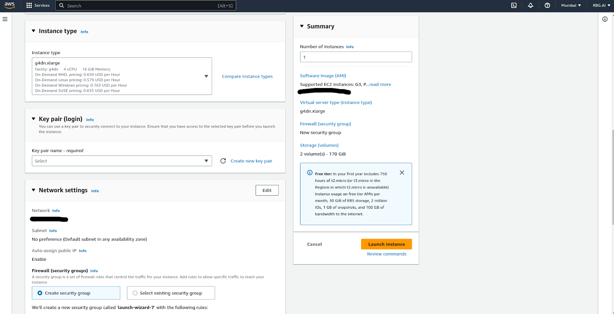
-> In the key pair, set the pair type as RSA and file format as .pem (RSA is a popular encryption algorithm used for key pairs, and is supported by Amazon EC2. When you create a key pair, you can select RSA as the key pair type.)
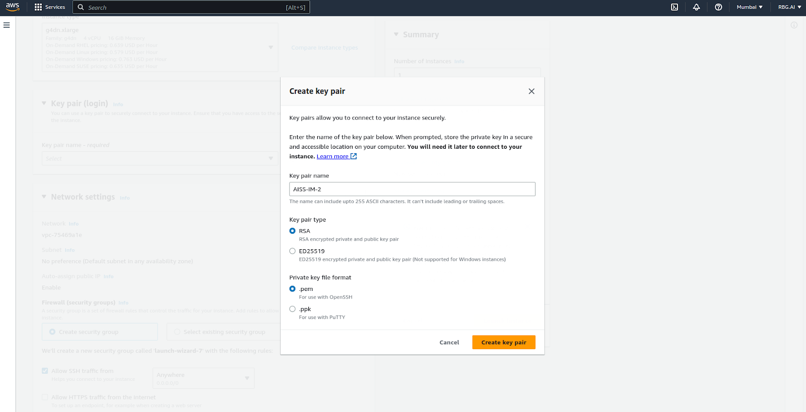

Go to “create security group” and allow the SSH traffic and set the storage details to 1000. 
(Note: Free tier customers are eligible upto only 30 GB of EBS General Purpose (SSD) or Magnetic Storage. Set the storage details accordingly if a Free tier customer.)
#### Security groups: 
* Security groups are stateful and provide filtering of ingress/egress network traffic to AWS resources.
* Removing unfettered connectivity to remote console services, such as SSH, reduces a server's exposure to risk. 
* It controls the inbound and outbound traffic our EC2 instance can receive or send.
* It allows SSH traffic, via the TCP protocol over port 22 from Anywhere (0.0.0.0/0). 
* 'Anywhere' is represented as a series of zeroes and this rule will allow traffic from any Source Address via the configured protocol.
* A private IPv4 address is an IP address that's not reachable over the Internet.
* When we launch an EC2 instance into an IPv4-only subnet, the instance receives a primary private IP address from the IPv4 address range of the subnet.


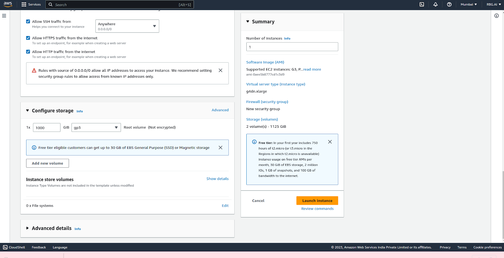
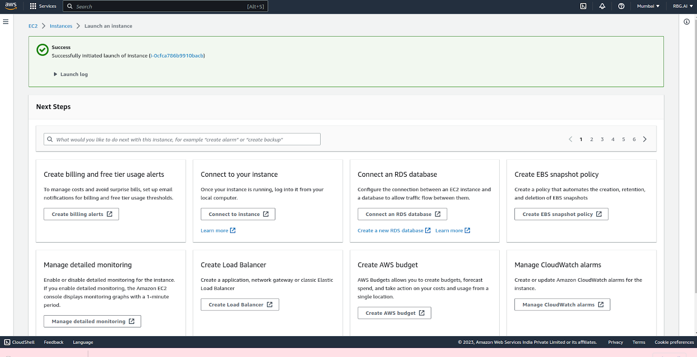
The instance has been created and running as shown in the below image.

Instance summary gives all the details like public ip, security details, instance status.

In the security groups, we can edit the inbound rules at the port range to 8888.

#### Inbound rules: 
* When we create a security group, it has no inbound rules. No inbound traffic originating from another host to our instance is allowed until we add inbound rules to the security group.
* We can create an inbound rule from the combinations of given choices in the dropdowns of the options. Add rule type, protocol to be used, port range, source, description, etc.
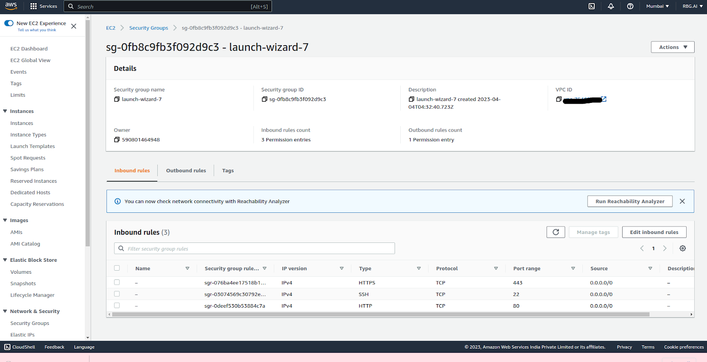
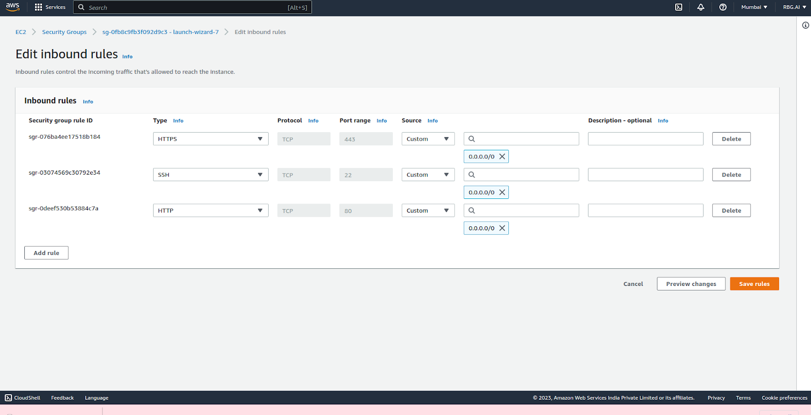

In the customs, select “Anywhere IPv4” and click “save rules”. If you want to restrict the instance to be reached from specific IP, you can also configure it here.


We can see the port added to the inbound rules.
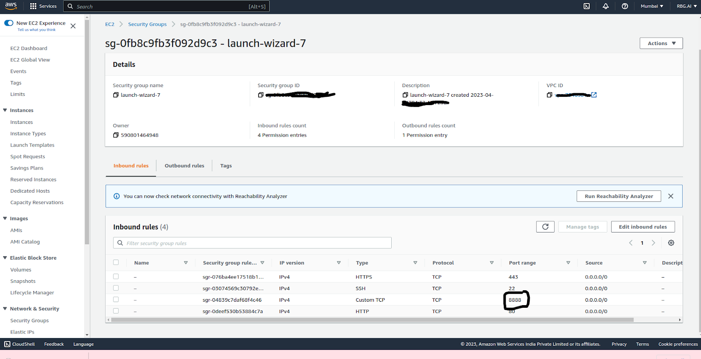


## Step 2: Customize EC2 server for Jupyter

Now we have connected to the instance 
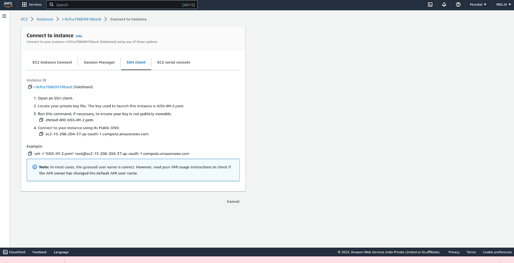

## Step 3: Connecting to our EC2

Open the Linux terminal and run the following commands.c
```
chmod 400 /path/YourKey.pem
```
* chmod is a command used to change the permissions of a file or directory.
* 400 is a permission code that sets the file to be readable only by the owner of the file. This means that no one else can read, write, or execute the file.
* /path/YourKey.pem is the path to your private key file. Replace this with the actual path and file name of your private key.

```
ssh -i "YourKey.pem" ubuntu@ec2-ip.ap-south-1.compute.amazonaws.com
```

* ssh is the command to start an SSH connection.
* -i "YourKey.pem" specifies the path and file name of your private key. Replace "YourKey.pem" with the actual name of your private key file.
* ubuntu is the default user name for Ubuntu Amazon Machine Images (AMIs). If you're using a different AMI, you may need to use a different user name. (could be “ec2_user” in some cases)
* ec2-ip.ap-south-1.compute.amazonaws.com is the public DNS name or IP address of your EC2 instance.

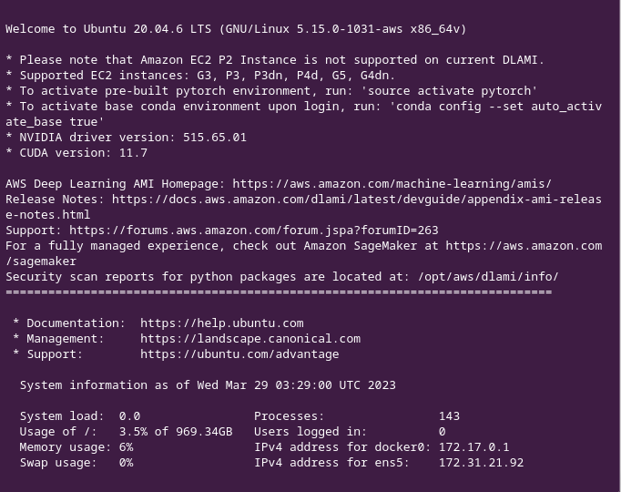

We will be getting this message depending on the operating system.

## Installing Jupyter Notebook

Open the .bashrc file
```
nano .bashrc
```

Add the following path at that end of the file
```
export PATH=$PATH:~/.local/bin
```

Then source the .bashrc file to get the changes reflected.
```
source ~/.bashrc
```


Press **Control +O** and  press **Enter** to save the file.
Press **Control+X** to exit 

Install pip (if not already present)

```
sudo apt install python3-pip
```
Install jupyter using pip command
```
pip install jupyter
```
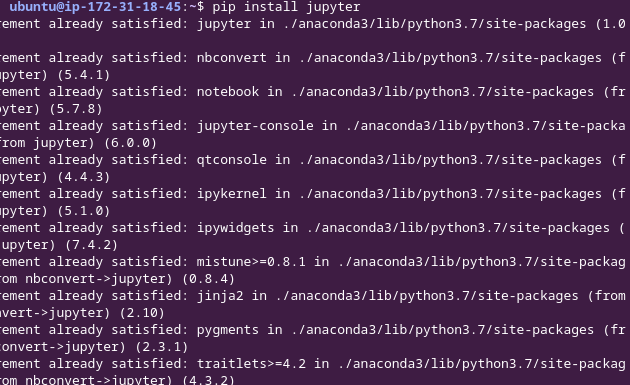

## Step 5: Configuring Jupyter Notebook settings

Install ipython (follow installing the same version to avoid errors, due to the deprecation of few modules in the latest versions)

```
pip install ipython==7.34.0
```

create a jupyter configuration file for updating the port, hosting IP and password.
```
jupyter notebook --generate-config
```


After creating our config file, we will need to generate a password for our Jupyter                      Notebook using ipython:

```
ipython
```
```
from IPython.lib import passwd
passwd()
```

Then enter the password and re-enter it for verification. Copy the hash message and save it for later. Exit from ipython


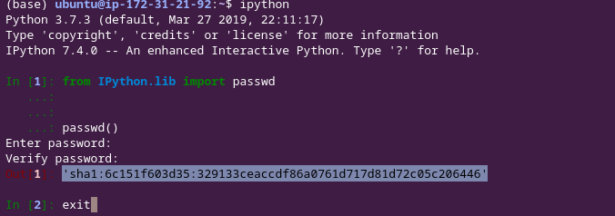

Go to the jupyter config file

```
cd .jupyter
nano jupyter_notebook_config.py
```

Add the following code at the beginning of the config file
```
conf = get_config()
conf.NotebookApp.ip = '0.0.0.0'
conf.NotebookApp.password = 'sha1:f1d5bfbcca7c:823e9101e9327e8d71eb68f88c7850f895bf7d2a' # paste your hashed password from previous step
conf.NotebookApp.port = 8888

```
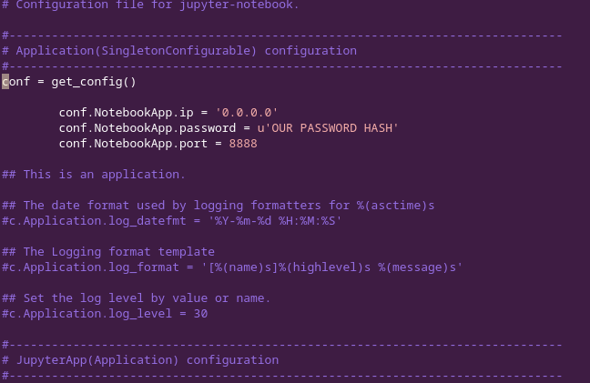

**Ctrl + O** to save and **Ctrl X** to quit . Check for single quote format issues.

 Use nohup to run the jupyter notebook in the background so that closing the terminal will not stop the server.

```
nohup jupyter notebook --allow-root > error.log &
```
Now the jupyter will be launched at the public ip address of the instance. You can access the notebook at the 8888 port with configured password.

http://your_public_ip:8888


